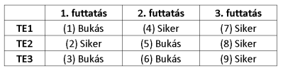
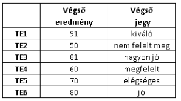
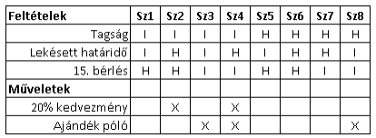
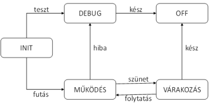
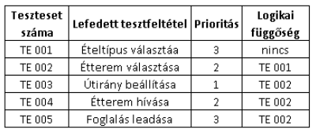
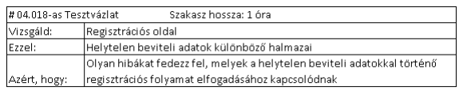
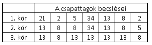
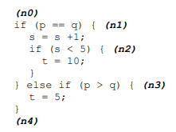
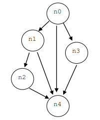
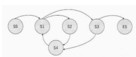

# Enable Copy
**LEGJOBB** = https://chromewebstore.google.com/detail/enable-right-click-allow/mlloloooolpffjkjaclpfpeednngpjon  
Második legjobb talán = https://chromewebstore.google.com/detail/enable-copy-paste-ecp/fpjppnhnpnknbenelmbnidjbolhandnf  
Harmadik csak ha a többi rossz = https://chromewebstore.google.com/detail/supercopy-enable-copy/onepmapfbjohnegdmfhndpefjkppbjkm

# Screenshot
https://chromewebstore.google.com/detail/gofullpage-full-page-scre/fdpohaocaechififmbbbbbknoalclacl

# ISTQB szavak és jelentései
https://glossary.istqb.org/hu_HU/search?term=&exact_matches_first=true

# GOOGLE DRIVE
https://drive.google.com/drive/folders/1NKUe140MVZY8VdNfDxF1mvuK8UXD-Yud?usp=sharing

# CTFL - Vizsga
### 1. Az alábbi állítások közül melyik ír le érvényes tesztcélt?
a) Bizonyítani, hogy a tesztelt rendszerben nincsenek kijavítatlan hibák.  
b) Bizonyítani, hogy a rendszer élesbe állítása után nem lesznek meghibásodások.  
c) Csökkenteni a teszt tárgyának kockázati szintjét és megalapozni a minőségi szintbe vetett
bizalmat.✅   
d) Ellenőrizni, hogy nincsenek nem tesztelt bemeneti kombinációk.

### 2. Az alábbi lehetőségek közül melyik jó példa olyan teszttevékenységre, amely hozzájárul a sikerhez?
a) A tesztelőket bevonjuk a különböző szoftverfejlesztési életciklus (SDLC) tevékenységekbe és
ez segít a munkatermékek hibáinak észlelésében.✅  
b) A tesztelők igyekeznek nem zavarni a fejlesztőket kódolás közben, hogy azok jobb kódot
írjanak.  
c) A teszelők együttműködnek a végfelhasználókkal a hibajelentések minőségének javításában
a komponens integrációs tesztelés a rendszertesztelés során.  
d) A minősített tesztelők sokkal jobb teszteseteket terveznek, mint a nem minősített tesztelők.

### 3. Egy új rendszert inkrementálisan előállító csapathoz kerültél tesztelőként. Észrevetted, hogy a meglévő regressziós tesztesetekben több iteráció óta nem történt módosítás, és nem azonosítottak új regressziós hibákat. A menedzsered boldog, de te nem. Melyik tesztelési alapelv magyarázza szkepticizmusod?
a) A tesztek elkopnak.✅  
b) A hibamentesség téveszméje.  
c) Hibafürtök megjelenése.  
d) Nem lehetséges kimerítő teszt.

### 4. Egy ételrendeléshez mobilalkalmazást fejlesztő csapatban dolgozol. A jelenlegi iteráció során a csapat a fizetési funkció bevezetése mellett döntött. Az alábbi tevékenységek közül melyik része a tesztelemzésnek?
a) Becslés, miszerint a fizetési szolgáltatással való integráció tesztelése 8 embernapot vesz
igénybe.  
b) Döntés, miszerint a csapatnak tesztelnie kell a fizetés több felhasználó közötti helyes
megosztását.✅  
c) Tesztadatok meghatározása határérték-elemzés (BVA) használatával azokhoz a
tesztesetekhez, amelyek a minimálisan megengedett fizethető összeg esetén ellenőrzik a
fizetés helyes feldolgozását.  
d) A hitelkártyás fizetés folyamatát ellenőrző teszteset során észlelt tényleges és elvárt
eredmény közötti eltérés elemzése és a hiba jelentése.

### 5. Az alábbi tényezők közül melyik befolyásolja JELENTŐSEN a tesztfolyamatot? 
i. A szoftverfejlesztési életciklus (SDLC)  
ii. A korábbi projektekben észlelt hibák száma  
iii. Az azonosított termékkockázatok  
iv. Új, formális fehérdoboz tesztelést kötelezővé tevő szabályozási követelmények  
v. A tesztkörnyezet beállítása

a) i, ii jelentősen befolyásolja  
b) i, iii, iv jelentősen befolyásolja✅  
c) ii, iv, v jelentősen befolyásolja  
d) iii, v jelentősen befolyásolja

### 6. Az alábbi feladatok közül melyik tartozik LEGINKÁBB a tesztelés szerepkörhöz?

a) A tesztkörnyezetek konfigurálása.✅  
b) A teendőslista (backlog) naprakészen tartása.  
c) Megoldások tervezése az új követelményekhez.  
d) A tesztterv elkészítése.  
e) A tesztbázis elemzése.✅

### 7. Az alábbi készségek (i-v) közül melyek a LEGFONTOSABBAK egy tesztelő számára?
i. A domén ismerete  
ii. Termékközpontúság  
iii. Jó csapatjátékosnak lenni  
iv. A csapat munkájának tervezése, szervezése  
v. Kritikus gondolkodás

a) ii és iv fontos  
b) i, iii és v fontos✅  
c) i, ii és v fontos  
d) iii és iv fontos

 ### 8. Hogyan jelenik meg a teljes csapat megközelítés a tesztelők és az üzlet képviselői közötti interakciókban?

a) Az üzlet képviselői döntenek a tesztautomatizálási megközelítésekről.  
b) A tesztelők segítenek az üzlet képviselőinek a tesztstratégia meghatározásában.  
c) Az üzlet képviselői nem tartoznak a teljes csapat megközelítéshez.  
d) A tesztelők segítenek az üzlet képviselőinek a megfelelő elfogadási tesztek elkészítésében.✅

### 9. Vedd fontolóra a következő szabályt: "a szoftverfejlesztési életciklus (SDLC) minden tevékenységéhez tartozik egy megfelelő tesztelési tevékenység". Mely SDLC modellekben érvényes ez a szabály?

a) Csak a szekvenciális modellekben  
b) Csak iteratív modellekben  
c) Csak iteratív és inkrementális modellekben  
d) Szekvenciális, inkrementális és iteratív modellekben✅

### 10. Az alábbi állítások közül melyik jellemzi a LEGJOBBAN az elfogadásiteszt-vezérelt fejlesztés (ATDD) megközelítését?

a) Az ATDD-ben az elfogadási kritériumokat jellemzően az amennyiben (given)/ha (when)/akkor (then) formátum alapján hozzák létre.  
b) Az ATDD-ben a teszteseteket főként a komponenstesztelés során hozzák létre, és azok kódorientáltak.  
c) Az ATDD-ben a tesztek az elfogadási feltételek alapján jönnek létre, hogy irányt adjanak a kapcsolódó szoftver fejlesztésének.✅  
d) Az ATDD-ben a tesztek a szoftver kívánt viselkedésén alapulnak, ami megkönnyíti a csapattagok számára azok megértését.

### 11. Az alábbiak közül melyik NEM példa a shift-left megközelítésre?

a) A felhasználói követelmények felülvizsgálata, mielőtt az érdekelt felek hivatalosan elfogadják azokat.  
b) Komponens teszt írása a vonatkozó kód megírása előtt.  
c) Egy komponens teljesítményhatékonysági tesztjének végrehajtása a komponens tesztelése során.  
d) Tesztszkript írása a konfigurációmenedzsment folyamat beállítása előtt.✅

### 12. Az alábbi érvek közül melyikkel győznéd meg a vezetődet, hogy minden kiadási ciklus végén szervezzen visszatekintő megbeszélést?

a) A visszatekintő megbeszélések manapság nagyon népszerűek, és az ügyfelek nagyra értékelnék, ha a folyamatainkba beépítenénk őket.  
b) A visszatekintő megbeszélések szervezése pénzt takarít meg a szervezetnek, mivel enélkül a végfelhasználók képviselői nem adnak azonnali visszajelzést a termékről.  
c) A visszatekintő megbeszélés során azonosított folyamatbeli gyengeségek elemezhetők, és a szervezet folyamatos folyamatfejlesztési programjának tennivalólistájaként szolgálhatnak.✅  
d) A visszatekintő megbeszélések öt értéket hangsúlyoznak, köztük a bátorságot és a tiszteletet, amelyek elengedhetetlenek a szervezet folyamatos fejlődésének fenntartásához.

### 13. Az alábbi (A-D) tesztszinteken JELLEMZŐEN a meghibásodások mely típusai (1-4) történhetnek?

1.Meghibásodások a rendszer viselkedésében, mivel az eltér a felhasználó üzleti igényeitől  
2.Meghibásodások a komponensek közötti kommunikációban  
3.Meghibásodások a modul logikájában  
4.Meghibásodások a nem megfelelően megvalósított üzleti szabályok miatt

A. Komponenstesztelés  
B. Komponens integrációs tesztelés  
C. Rendszertesztelés  
D. Elfogadási tesztelés

a) 1D, 2B, 3A, 4C✅  
b) 1D, 2B, 3C, 4A  
c) 1B, 2A, 3D, 4C  
d) 1C, 2B, 3A, 4D  

### 14. Egy felhasználói történetet tesztelsz három elfogadási kritériummal: EK1, EK2 és EK3. Az EK1-re a TE1 teszteset, az EK2-re a TE2, az EK3-ra pedig a TE3 teszteset vonatkozik. A jelenlegi tesztvégrehajtás előzménye három tesztfuttatás volt a szoftver három egymást követő verzióján az alábbiak szerint:

A tesztek megismétlésére akkor kerül sor, amikora tesztfuttatás során talált összes hibát kijavították, és a szoftver új verziója elérhetővé vált. A fenti tesztek közül melyeket hajtják végre regressziós tesztként?

a) Csak ezeket: 4, 7, 8, 9  
b) Csak ezeket: 5, 7✅  
c) Csak ezeket: 4, 6, 8, 9  
d) Csak ezeket: 5, 6

### 15. Az alábbiak közül melyik NEM a statikus tesztelés előnye?

a) Kevésbé költséges hibamenedzsment, mivel a hibákat a szoftverfejlesztési életciklus későbbi
szakaszában könnyebben lehet felfedezni.✅  
b) A statikus tesztelés során talált hibák javítása általában sokkal olcsóbb, mint a dinamikus
tesztelés során talált hibák javítása.  
c) Olyan kódolási hibák megtalálása, amelyeket a dinamikus teszteléssel nem feltétlenül
lehetett volna megtalálni.  
d) A követelményekben lévő hiányosságok és következetlenségek felderítése.

### 16. Az alábbiak közül melyik a korai és gyakori visszajelzés előnye?

a) Fejleszti a jövőbeli projektek tesztfolyamatát.  
b) Arra kényszeríti az ügyfeleket, hogy a megállapított kockázatok alapján rangsorolják
követelményeiket.  
c) A változások minőségének mérésére szolgál.  
d) Segít elkerülni a követelményekkel kapcsolatos félreértéseket.✅

### 17. A szervezetben használt felülvizsgálatok a következő jellemzőkkel rendelkeznek:
● Van írnok szerepkör  
● A fő cél a minőség kiértékelése  
● A megbeszélést a munkatermék szerzője vezeti  
● Van egyéni felkészülés  
● Felülvizsgálati jelentés készül  
Az alábbi felülvizsgálati típusok közül melyiket használják a LEGNAGYOBB valószínűséggel?

a) Informális felülvizsgálat  
b) Átvizsgálás✅  
c) Technikai felülvizsgálat  
d) Inspekció

### 18. Az alábbi állítások közül melyik tényező NEM járul hozzá a sikeres felülvizsgálatokhoz?

a) A résztvevőknek megfelelő időt kell szánniuk a felülvizsgálatra.  
b) A nagy munkatermékek kisebb részekre bontása, hogy a szükséges erőfeszítést kevésbé
terhelővé tegye.  
c) A résztvevőknek kerülniük kell az olyan viselkedést, amely unalomra, elkeseredettségre vagy
ellenségeskedésre utalhat a többi résztvevő felé.  
d) A feltárt meghibásodásokat el kell ismerni, meg kell becsülni és objektíven kell kezelni.✅

### 19 Az alábbiak közül melyik jellemzi a tapasztalatalapú teszttechnikákat?

a) A tesztesetek részletes tervezési információk alapján készülnek.  
b) Az interfész kódrészen belül tesztelt elemek a lefedettség mérésére szolgálnak.  
c) A technikák nagymértékben támaszkodnak a tesztelők ismereteire a szoftverrel és az üzleti
doménnel kapcsolatban.✅  
d) A teszteseteket a követelményektől való eltérések azonosítására használják.  

### 20. Egy egyszerűsített lakáskereső űrlapot tesztelsz, amely csak két keresési kritériummal rendelkezik:
● emelet (három lehetséges opcióval: földszint; első emelet; második vagy
magasabb emelet),  
● kert típusa (három lehetséges opcióval: nincs kert; kis kert; nagy kert).  

Csak a földszinti lakások rendelkezhetnek kerttel. Az űrlap rendelkezik egy
beépített érvényesítési mechanizmussal, amely nem engedi olyan keresési
feltételek használatát, amelyek megsértik ezt a szabályt.
Minden tesztnek két bemeneti értéke van: az emelet és a kert típusa. Ekvivalencia
partícionálást (EP) szeretnél alkalmazni, hogy a tesztek minden emelet és minden
kerttípust lefedjenek.  

Mennyi teszteset szükséges LEGALÁBB a 100%-os EP-lefedettség eléréséhez?

a) 3  
b) 4✅  
c) 5  
d) 6

### 21. Egy olyan rendszert tesztelsz, amely kiszámítja egy adott diák végső jegyét egy kurzuson. A végső jegyet a végeredmény alapján osztja ki a rendszer a következő szabályok szerint:
● 0 - 50 pont: nem felelt meg  
● 51-60 pont: megfelelt  
● 61-70 pont: elégséges  
● 71-80 pont: jó  
● 81-90 pont: nagyon jó  
● 91-100 pont: kiváló  
Az alábbi teszteseteket készítetted el:  

Mekkora lefedettséget érnek el a létező tesztesetek 2 értékű határérték-elemzést (BVA) végezve a végső eredményre?

a) 50%✅  
b) 60%  
c) 33.3%  
d) 100%

### 22. Kedvenc napi kerékpárkölcsönződ épp most vezetett be egy új ügyfélkapcsolat-kezelő rendszert, és megkért téged, az egyik leghűségesebb tagjukat, hogy teszteld azt. A bevezetett funkciók a következők:
● Bárki bérelhet kerékpárt, de a tagok 20% kedvezményt kapnak.  
● Ha azonban a leadási határidőt elmulasztják, a kedvezmény már nem
vehető igénybe.  
● 15 bérlés után a tagok ajándékot kapnak: egy pólót.  

A megvalósított funkciókat leíró döntési táblázat a következőképpen néz ki:

KIZÁRÓLAG az ügyfélkapcsolat-kezelő rendszer funkcióleírása alapján a fenti
szabályok közül melyik ír le lehetetlen helyzetet?

a) Sz4  
b) Sz2  
c) Sz6  
d) Sz8✅

### 23. Egy olyan rendszert tesztelsz, amelynek életciklusát az alábbi állapotátmenet-diagram modellezi. A rendszer az INIT állapotban indul, és a működése az OFF állapotban fejeződik be.
  
MINIMUM mennyi teszteset szükséges érvényes átmenet lefedettség eléréséhez?

a) 4  
b) 2  
c) 7  
d) 3✅

### 24. A tesztkészleted 100%-os utasításlefedettséget ért el. Mi a következménye ennek a ténynek?

a) A kódban minden, hibát tartalmazó utasítás legalább egyszer végrehajtásra került.✅  
b) Bármely tesztcsomag, amely több tesztesetet tartalmaz, mint a te tesztcsomagod, szintén
100%-os utasításlefedettséget fog elérni.  
c) A kód minden egyes útvonala legalább egyszer végrehajtásra került.  
d) A bemeneti értékek minden kombinációja legalább egyszer tesztelésre került.  

### 25. Az alábbiak közül melyik NEM igaz a fehérdoboz tesztelésre?

a) A fehérdoboz tesztelés során a szoftver teljes implementációját figyelembe veszik.  
b) A fehérdoboz lefedettségi metrikák segíthetnek további tesztek azonosításában a
kódlefedettség növelése érdekében.  
c) A fehérdoboz-teszttechnikák a statikus tesztelésben is alkalmazhatók.  
d) A fehérdoboz tesztelés segíthet azonosítani a követelmények megvalósításának
hiányosságait.✅  

### 26. Az alábbiak közül melyik írja le a LEGJOBBAN a hibasejtés koncepcióját?

a) A hibasejtés magában foglalja a múltban talált hibákról és a fejlesztők által elkövetett tipikus
hibákról szerzett tudásod és tapasztalatod felhasználását.✅  
b) A hibasejtés magában foglalja a fejlesztéssel kapcsolatos személyes tapasztalataidnak és a
fejlesztőként elkövetett hibáidnak a felhasználását.  
c) A hibasejtés során azt kell elképzelned, hogy a teszt tárgyának felhasználója vagy, és meg kell
találnod azokat a hibákat, amelyeket a felhasználó a teszt tárgyával való interakció során
elkövethet.  
d) A hibasejtés során gyorsan le kell másolnod a fejlesztési feladatot, hogy azonosítsd a
fejlesztő által elkövethető hibákat.

### 27. A projektedben késett egy vadonatúj alkalmazás kiadása, ezért a tesztek végrehajtása későn kezdődött, ugyanakkor nagyon részletes szakterületi ismeretekkel és jó elemzői készségekkel rendelkezel. A követelmények teljes listáját még nem osztották meg a csapattal, de a vezetőség már kéri néhány teszteredmény bemutatását. Melyik tesztelési technika illik LEGJOBBAN ehhez a helyzethez?

a) Ellenőrzőlista alapú felülvizsgálat  
b) Hibasejtés  
c) Felderítő tesztelés ✅   
d) Elágazási tesztelés

### 28. Az alábbiak közül melyik írja le LEGJOBBAN az elfogadási feltételek dokumentálásának módját?

a) Visszatekintő megbeszélések lefolytatása az érdekelt felek valódi igényeinek
meghatározására egy adott felhasználói történettel kapcsolatban.  
b) Az amennyiben (given)/ha (when)/akkor (then) formátum használata egy adott felhasználói
történethez kapcsolódó példa tesztfeltétel leírására.✅  
c) Szóbeli kommunikáció, hogy csökkentsük annak kockázatát, hogy mások valamit
félreértsenek.  
d) Egy adott felhasználói történethez kapcsolódó kockázatok dokumentálása a teszttervben,
hogy megkönnyítse az adott felhasználói történet kockázatalapú tesztelését.  

### 29. Tekintsd meg az alábbi felhasználói történetet:
Szerkesztőként  
szeretném átnézni a tartalmat a közzététel előtt  
így biztosíthatom, hogy a nyelvtan helyes legyen.  
és annak elfogadási kritériumait:  
● A felhasználó "Szerkesztő" szerepkörrel beléphet a tartalomkezelő
rendszerbe.  
● A szerkesztő megtekintheti a meglévő tartalmi oldalakat.  
● A szerkesztő szerkesztheti az oldal tartalmát.  
● A szerkesztő javítási megjegyzéseket hozhat létre.  
● A szerkesztő elmentheti a változtatásokat.  
● A szerkesztő visszaküldhet a "tartalomtulajdonos" szerepkörnek frissítés
céljából.  
Az alábbiak közül melyik az elfogadásiteszt-vezérelt fejlesztés (ATDD) teszt
LEGJOBB példája ennél a felhasználói történetnél?

a) Annak tesztelése, hogy a szerkesztő el tudja-e menteni a dokumentumot az oldal
tartalmának módosítása után.✅  
b) Annak tesztelése, hogy a tartalom tulajdonosa be tud-e jelentkezni és frissíteni tudja-e a
tartalmat.  
c) Annak tesztelése, hogy a szerkesztő be tudja-e ütemezni a szerkesztett tartalom
közzétételét.  
d) Annak tesztelése, hogy a szerkesztő ki tud-e választani egy másik szerkesztőt a frissítéshez.  

### 30. Hogyan adnak értéket a tesztelők az iteráció és a kiadás tervezéséhez?

a) A tesztelők határozzák meg a fejlesztendő felhasználói történetek prioritását.  
b) A tesztelők csak a tesztelendő rendszer funkcionális szempontjaira összpontosítanak.  
c) A tesztelők részt vesznek a felhasználói történetek részletes kockázatazonosításában és
kockázatértékelésében.✅  
d) A tesztelők a kiadás tervezése során a korai teszttervezéssel garantálják a kiváló minőségű
szoftverek kiadását.  

### 31. Az alábbi lehetőségek közül melyik a rendszer tesztelésének kilépési kritériuma?

a) A tesztkörnyezet készenléte.  
b) A tesztelő képes bejelentkezni a tesztelési objektumba.  
c) A becsült hibasűrűség elérése.✅  
d) A követelmények lefordítása amennyiben (given)/ha (when)/akkor (then) formátumra.  
e) A regressziós teszteket automatizálták.✅

### 32. Csapatod a hárompontos becslési technikát használja egy új, nagy kockázatú funkció tesztelési ráfordításainak becslésére. A következő becslések születtek:
- legoptimistább becslés: 2 ember-óra
- legvalószínűbb becslés: 11 ember-óra
- legpesszimistább becslés: 14 ember-óra  
Mi a végső becslés?

a) 9 ember-óra  
b) 14 ember-óra  
c) 11 ember-óra  
d) 10 ember-óra✅

### 33. Egy olyan mobilalkalmazást tesztelsz, amely segítségével a felhasználók a kívánt étel típusa alapján találhatnak a közelben éttermet. Tekintsd meg a tesztesetek, prioritások (az alacsonyabb szám magasabb prioritást jelent) és függőségek következő listáját:
  
Az alábbi tesztesetek közül melyiket kell harmadikként végrehajtani?

a) TC 003✅  
b) TC 005  
c) TC 002  
d) TC 001

### 34. Tekintd meg a következő tesztkategóriákat (1-4) és agilis tesztelési kvadránsokat (A-D):

1.Használhatósági tesztelés  
2.Komponenstesztelés  
3.Funkcionális tesztelés  
4.Megbízhatósági tesztelés  

A. Agilis tesztelési kvadráns Q1: technológia szemléletű, a fejlesztőcsapat támogatása  
B. Agilis tesztelési kvadráns Q2: üzleti szemléletű, a fejlesztőcsapat támogatása  
C. Agilis tesztelési kvadráns Q3: üzlet szemléletű, a termék kritikája  
D. Agilis tesztelési kvadráns Q4: technológia szemléletű, a termék kritikája  

Hogyan illeszkednek a fenti tesztkategóriák az agilis tesztelési kvadránsokhoz?

a) 1C, 2A, 3B, 4D✅  
b) 1D, 2A, 3C, 4B  
c) 1C, 2B, 3D, 4A  
d) 1D, 2B, 3C, 4A

### 35. A kockázatelemzés során a következő kockázatot azonosították és értékelték:
- Kockázat: A jelentéslétrehozás válaszideje túl hosszú.
- Kockázat valószínűsége: közepes; kockázat hatása: magas.
- Válasz a kockázatra:
- egy független tesztelő csoport a rendszertesztelés során
teljesítménytesztelést végez,
- a végfelhasználók egy kiválasztott mintája alfa- és béta-elfogadási
tesztelést végez a kiadás előtt.  

Milyen intézkedést javasolnak válaszul erre az elemzett kockázatra?

a) Kockázatelfogadás  
b) Vészhelyzeti terv  
c) Kockázatmérséklés✅  
d) Kockázatátruházás

### 36. Melyik munkaterméket használhatja egy agilis csapat, hogy megmutassa az elvégzett munka mennyiségét és a teljes hátralévő munka mennyiségét egy adott iterációban?

a) Elfogadási kritériumok  
b) Hibajelentés  
c) Összefoglaló tesztjelentés  
d) Kivitelezési görbe✅

### 37. Frissítened kell az egyik automatizált tesztszkriptet, hogy megfeleljen egy új követelménynek. Melyik folyamat jelzi, ha létrehozod a tesztszkript egy új verzióját a tesztadattárban?

a) Nyomonkövethetőségi irányítás  
b) Karbantartási tesztelés  
c) Konfigurációkezelés✅  
d) Követelménytervezés

### 38. Az alábbi hibajelentést kaptad a fejlesztőktől, amely szerint a tesztjelentésben leírt rendellenesség nem reprodukálható.

Az alkalmazás leáll  

2022-Május-03 – John Doe – Elutasítva  

Az alkalmazás leáll, miután az új felhasználó létrehozásának képernyőjén a Név mezőbe
beírtam a "Tesztinput: $ä" szöveget. Próbáltam kijelentkezni, bejelentkezni a test_admin01
fiókkal, ugyanaz a probléma. Próbáltam más teszt admin fiókkal, ugyanaz a probléma. Nem
érkezett hibaüzenet; a napló (lásd csatolva) tartalmaz egy végzetes hiba figyelmeztetést. A
TC-1305 teszteset alapján az alkalmazásnak el kell fogadnia a megadott inputot, és létre kell
hoznia a felhasználót. Kérlek, javítsátok ki magas prioritással, ez a funkció a REQ-0012-hez
kapcsolódik, ami egy kritikus új üzleti követelmény.

Milyen kritikus információk hiányoznak ebből a tesztjelentésből, amelyek
hasznosak lettek volna a fejlesztők számára?

a) Elvárt és tényleges eredmény  
b) Referenciák és hibaállapot  
c) Tesztkörnyezet és tesztelem✅  
d) Prioritás és súlyosság  

### 39. Milyen tesztelési tevékenységet támogat egy adatelőkészítő eszköz?

a) Tesztfelügyelet és -irányítás  
b) Tesztelemzés és -tervezés  
c) Tesztmegvalósítás és -végrehajtás✅  
d) Tesztlezárás

### 40. Melyik elem azonosítja helyesen a teszt automatizálás végrehajtásának lehetséges kockázatát?

a) Ismeretlen regressziókat vezethet be a produktív környezetben.  
b) Lehet, hogy a tesztver karbantartására nem fordítanak elegendő erőfeszítést.✅  
c) A tesztelési eszközökre és a kapcsolódó tesztverre nem lehet kellőképpen támaszkodni.  
d) Csökkentheti a manuális tesztelésre szánt időt.

### 41. Azt a feladatot kaptad, hogy elemezd és javítsd a hibák okait egy új, kiadásra kerülő rendszerben. Milyen tevékenységet végzel?

a) Hibakeresés✅  
b) Szoftvertesztelés  
c) Követelményfeltárás  
d) Hibamenedzsment

### 42. Sok szoftveres szervezetben a tesztelési részleget minőségbiztosítási (QA) részlegnek nevezik. Helyes ez a mondat vagy sem, és miért?

a) Helyes. A tesztelés és a minőségbiztosítás pontosan ugyanazt jelenti.  
b) Helyes. Az elnevezések felcserélhetők, mivel mind a tesztelés, mind a minőségbiztosítás
ugyanazokra a minőségi kérdésekre koncentrálja tevékenységét.  
c) Nem helyes. A tesztelés többet jelent, magában foglal minden, a minőséggel kapcsolatos
tevékenységet. A minőségbiztosítás a minőséggel kapcsolatos folyamatokra összpontosít.  
d) Nem helyes. A minőségbiztosítás a minőséggel kapcsolatos folyamatokra összpontosít, míg a
tesztelés annak bizonyítására, hogy egy komponens vagy rendszer megfelel a célnak, és a
hibák felderítésére.✅  

### 43. A szomszédos fülkében csörgő telefon megzavarja a programozót, aki emiatt helytelenül programozza azt a logikát, amely egy bemeneti változó felső határát ellenőrzi. Később, a rendszer tesztelése során a tesztelő észreveszi, hogy ez a bemeneti mező érvénytelen bemeneti értékeket fogad el. Az alábbiak közül melyik írja le helyesen a helytelenül kódolt felső határt?

a) A kiváltó ok (root cause)  
b) Meghibásodás (failure)  
c) Emberi eredetű hiba (error)  
d) Hiba (defect)✅

### 44. Tekintsd meg az alábbi tesztvert

Melyik tesztelési tevékenység kimenete ez a tesztver?

a) Teszttervezés  
b) Tesztfelügyelet és -irányítás  
c) Tesztelemzés  
d) Műszaki teszttervezés✅

### 45. Az alábbiak közül melyik a LEGJOBB példa arra, hogy a nyomonkövethetőség hogyan támogatja a tesztelést?

a) Egy változás hatáselemzésének elvégzése tájékoztatást ad a tesztek elvégzéséről.  
b) A tesztesetek és a teszteredmények közötti nyomonkövethetőség elemzése információt ad a
fennmaradó kockázat becsült szintjéről.  
c) A változás hatáselemzésének elvégzése segít kiválasztani a megfelelő teszteseteket a
regressziós teszteléshez.✅  
d) A tesztbázis, a teszt tárgya és a tesztesetek közötti nyomonkövethetőség elemzése segít a
tesztadatok kiválasztásában, hogy elérjük a teszt tárgyának feltételezett lefedettségét.  

### 46. Az alábbiak közül melyik a LEGJOBB magyarázat a tesztelés függetlenségének előnyeire?

a) A független tesztelőcsoport alkalmazása lehetővé teszi a projektvezetés számára, hogy a
tesztelőcsoportra ruházza a végső eredmény minőségéért való felelősséget.  
b) Ha be lehet vonni a szervezeten kívüli tesztcsapatot, akkor ennek egyértelmű előnye, hogy a
külső csapatot nem befolyásolják olyan könnyen a projektvezetés szállítási aggályai és a
szigorú szállítási határidők betartásának szükségessége.  
c) Egy független tesztcsapat a fejlesztőktől elkülönülten dolgozhat, nem kell, hogy a
projektkövetelmények változásai megzavarják őket, és a fejlesztőkkel való kommunikációt
leszűkíthetik a hibakezelő rendszeren keresztül történő hibajelentésekre.  
d) Ha a specifikációk kétértelműségeket és ellentmondásokat tartalmaznak, az értelmezésükre
vonatkozóan feltételezések születnek, és egy független tesztelő hasznos lehet e
feltételezések és a fejlesztő által adott értelmezés megkérdőjelezésében.✅

### 47. Tesztelőként dolgozol egy V-modellt követő csapatban. Az alábbi tevékenységek közül melyeket lehet elvégezni a szoftverfejlesztési életciklus (SDLC) kezdeti fázisaiban?

a) Dinamikus tesztvégrehajtás  
b) Statikus tesztelés✅  
c) Teszttervezés✅  
d) Elfogadási tesztvégrehajtás  
e) Karbantartási tesztelés

### 48. Az alábbiak közül melyek a DevOps előnyei?
i. Gyorsabb termékkiadás és piacra jutás  
ii. Az ismétlődő kézi tesztelés szükségességének növelése  
iii. A futtatható szoftver folyamatos rendelkezésre állása  
iv. A kód refaktorálásával kapcsolatos regressziós tesztek számának csökkenése  
v. A tesztautomatizálási keretrendszer felállítása olcsó, mivel minden automatizálva van  

a) i, ii, iv előnyös  
b) iii, v előnyös  
c) i, iii előnyös✅  
d) ii, iv, v előnyös

### 49. Tesztelőként dolgozol az egyik ügyfél számára egy ételrendelésre szolgáló mobilalkalmazáson. Az ügyfél elküldte a követelmények listáját. Az egyik, kiemelt fontosságú követelmény a következő:
"A rendelést az esetek 95%-ában 10 másodpercnél rövidebb idő alatt kell feldolgozni".
Létrehoztál egy teszteset halmazt, amelyekben több, véletlenszerű rendelést adtál le, mérted a
feldolgozási időt, és a teszteredményeket összevetetted a követelményekkel.  
Milyen típusú tesztet hajtottál végre?

a) Funkcionális, mivel a tesztesetek a felhasználó által a rendszerrel szemben támasztott üzleti
követelményét fedik le.  
b) Nem-funkcionális, mert a rendszer teljesítményét mérik.✅  
c) Funkcionális, mert a tesztesetek kölcsönhatásba lépnek a felhasználói felülettel.  
d) Strukturális, mert ismernünk kell a program belső szerkezetét a rendelésfeldolgozási idő
méréséhez.

### 50. A szervezet tesztelési stratégiája szerint, ha egy rendszer visszavonásra kerül, az adatmigrációt tesztelni kell. Melyik teszttípus részeként kell ezt a tesztelést elvégezni a LEGNAGYOBB valószínűséggel?

a) Karbantartási tesztelés✅  
b) Regressziós tesztelés  
c) Komponenstesztelés  
d) Integrációs tesztelés

### 51. Az alábbiakban felsorolunk néhány, az SDLC során keletkező munkatermékeket.
i. Üzleti követelmények  
ii. Ütemterv  
iii. Tesztköltségvetés  
iv. Harmadik féltől származó futtatható kód  
v. Felhasználói történetek és azok elfogadási kritériumai  
Ezek közül melyik felülvizsgálható?

a) i és iv felülvizsgálható  
b) i, ii, iii és iv felülvizsgálható  
c) i, ii, iii és v felülvizsgálható✅  
d) iii, iv, v felülvizsgálható

### 52. Az alábbi állítások közül (i-v) melyek igazak a statikus tesztelésre?
i. A rendellenes külső viselkedés könnyebben azonosítható ezzel a teszteléssel.  
ii. A kódolási szabványtól való eltéréseket könnyebb megtalálni ezzel a teszteléssel.  
iii. A hibák által okozott meghibásodásokat a szoftver futtatása során azonosítja.  
iv. A tesztelés célja a hibák minél korábbi azonosítása.  
v. A kritikus biztonsági követelmények hiányzó lefedettségét könnyebb megtalálni és
kijavítani.  

a) i, iv, v igaz a statikus tesztelésre  
b) i, iii, iv igaz a statikus tesztelésre  
c) ii, iii igaz a statikus tesztelésre  
d) ii, iv, v igaz a statikus tesztelésre✅

### 53. Az alábbi, formális felülvizsgálatokra vonatkozó állítások közül melyik IGAZ?

a) Néhány felülvizsgálat nem igényel egynél több szerepkört.  
b) A felülvizsgálati folyamat több tevékenységből áll.✅  
c) A felülvizsgálandó dokumentációt nem osztják ki a felülvizsgálati ülés előtt, kivéve az egyes felülvizsgálati típusok esetében a munkaterméket.  
d) A felülvizsgálat során talált hibákat nem jelentik, mivel azokat nem dinamikus teszteléssel
találták meg.

### 54. Milyen feladatot vállalhat a menedzsment a formális felülvizsgálat során?

a) Általános felelősség vállalása a felülvizsgálatért.  
b) Annak eldöntése, hogy mit kell felülvizsgálni.✅  
c) A felülvizsgálati ülések hatékony lebonyolításának biztosítása, és szükség esetén közvetítés.  
d) A felülvizsgálati információk, például a felülvizsgálati határozatok rögzítése. 

### 55.  A bortároló rendszer egy olyan ellenőrző berendezést használ, amely méri a borcellák hőmérsékletét (T, °C-ban mérve, a legközelebbi fokra kerekítve), és riasztja a felhasználót, ha az eltér az optimális 12-es értéktől, a következő szabályok szerint:
- ha T = 12, a rendszer azt mondja, hogy "optimális hőmérséklet".
- ha T < 12, a rendszer azt mondja, hogy "a hőmérséklet túl alacsony!".
- ha T > 12, a rendszer azt mondja, hogy "a hőmérséklet túl magas!".  

A vezérlő eszköz viselkedésének ellenőrzésére a 3 pontos határérték-elemzést (BVA) szeretnéd
használni. A tesztbemenet a készülék által megadott hőmérséklet °C-ban.
Melyik az a MINIMÁLIS tesztbemenet-halmaz, amellyel a kívánt lefedettség 100%-a elérhető?

a) 11, 12, 13  
b) 10, 12, 14  
c) 10, 11, 12, 13, 14✅  
d) 10, 11, 13, 14

### 56. Az elágazás teszteléssel kapcsolatos alábbi állítások közül melyik HELYES?

a) Ha egy program csak feltétel nélküli elágazásokat tartalmaz, akkor 100%-os
elágazáslefedettség érhető el tesztesetek végrehajtása nélkül.  
b) Ha a tesztesetek a kód összes feltétel nélküli elágazását végrehajtják, akkor 100%-os
elágazáslefedettség érhető el.  
c) Ha 100%-os utasításlefedettség érhető el, akkor 100%-os elágazás lefedettség is elérhető.  
d) Ha 100%-os elágazáslefedettség érhető el, akkor a kód minden egyes döntési utasításában az
összes döntési kimenetet megvizsgáltuk.✅  

### 57. Egy olyan mobilalkalmazást tesztelsz, amin keresztül az ügyfelek elérik és kezelhetikbankszámláikat. Épp egy tesztkészletet futtatsz, amely tartalmazza minden egyes képernyőnek,valamint minden egyes képernyő minden egyes mezőjének értékelését. A tesztkészlet egynépszerű könyvből származó általános lista alapján készült, mely a felhasználói felület legjobb gyakorlatait tartalmazza és amely maximalizálja az ilyen alkalmazások vonzerejét, könnyű kezelhetőségét és hozzáférhetőségét. Az alábbi lehetőségek közül melyik kategória írja le LEGJOBBAN az általad használt tesztelésitechnikát?

a) Feketedoboz  
b) Felderítő  
c) Ellenőrzőlista-alapú✅  
d) Hibasejtés

### 58. Az alábbiak közül melyek jellemzik a LEGINKÁBB a felhasználói történet-írás kollaboratív megközelítését?

a) A felhasználói történeteket a tesztelők és a fejlesztők készítik, majd az üzlet képviselői
elfogadják.  
b) A felhasználói történeteket az üzlet képviselői, a fejlesztők és a tesztelők együttesen hozzák
létre.✅  
c) A felhasználói történeteket az üzlet képviselői készítik, majd a fejlesztők és a tesztelők
ellenőrzik.  
d) A felhasználói történeteket úgy hozzák létre, hogy függetlenek, tárgyalhatóak, értékesek,
becsülhetőek, kicsik és tesztelhetőek legyenek.

### 59. Tekintsd meg a tesztterv következő részét. A tesztelés komponensteszteléssel és komponens integrációs teszteléssel történik. A szabályozás előírja, hogy minden egyes kritikusnak minősített komponens esetében bizonyítani kell a 100%-os elágazás-lefedettség elérését. A tesztterv melyik részéhez tartozik ez a rész?

a) Kommunikáció  
b) Kockázati nyilvántartás  
c) A tesztelés környezete  
d) Tesztmegközelítés✅

### 60. A csapatod tervezési pókert használ egy újonnan igényelt funkció tesztelési ráfordításainak becslésére. A csapatodban van egy olyan szabály, hogy ha nincs idő a teljes egyetértésre, és az eredmények eltérése kicsi, akkor bizonyos szabályok alkalmazására kerülhet sor, mint például "a legtöbb szavazatot kapott szám elfogadása". Két forduló után sem sikerült konszenzusra jutni, ezért harmadik fordulót kezdeményeztek. A tesztbecslés eredményei az alábbi táblázatban láthatók.

Az alábbiak közül melyik a LEGJOBB példa a következő lépésre?

a) A terméktulajdonosnak kell közbelépnie és meghoznia a végső döntést.  
b) Elfogadjátok a 13-as értéket végső tesztbecslésként, mivel ez rendelkezik a legtöbb
szavazattal.✅  
c) Nincs szükség további lépésekre. Konszenzus született.  
d) Az új funkciót eltávolítjátok a jelenlegi kiadásból, mivel nem született konszenzus.  

### 61. Az alábbiak közül melyik IGAZ a tesztpiramisra vonatkozóan?

a) Hangsúlyozza, hogy sokkal több tesztet kell elvégezni az alacsonyabb tesztszinteken.✅  
b) Azt javasolja, hogy minden egyes alacsony szintű teszt a funkcionalitás nagy részét
ellenőrizze.  
c) A teszttípusok eloszlását írja le a szoftverfejlesztési életcikluson belül.  
d) Nincs hatása az automatizált tesztek létrehozására.

### 62. A kockázatelemzés során a csoport a következő kockázatot vette számításba: "A rendszer túl magas árengedményt engedélyez egy ügyfél számára". A csapat a kockázat hatását nagyon magasra becsülte. Mit lehet mondani a kockázat valószínűségéről?

a) Nagyon magas. A kockázat magas hatása mindig a kockázat magas valószínűségét jelenti.  
b) Nagyon alacsony. A kockázat magas hatása mindig a kockázat alacsony valószínűségét jelenti.  
c) Nem lehet nyilatkozni. A kockázat hatása és a kockázat valószínűsége függetlenek egymástól.✅  
d) A kockázat valószínűsége nem fontos ilyen magas kockázati hatás esetén. Nem kell
meghatározni.

### 63. Az alábbi lista egy fejlesztendő új szoftvertermékkel kapcsolatban azonosított kockázatokat tartalmazza:
i. A vezetőség két tapasztalt tesztelőt áthelyez egy másik projektbe  
ii. A rendszer nem felel meg a funkcionális biztonsági szabványoknak  
iii. A rendszer válaszideje túllépi a felhasználói követelményeket  
iv. Az érdekelt felek elvárásai pontatlanok  
v. A fogyatékkal élők problémákkal küzdenek a rendszer használata során  

Melyek ezek közül a projektkockázatok?

a) i, iv projektkockázat✅  
b) iv, v projektkockázat  
c) i, iii projektkockázat  
d) ii, v projektkockázat  

### 64. Az alábbiak közül melyik példa arra, hogy a termék kockázatelemzése hogyan befolyásolja a tesztelés alaposságát és terjedelmét?

a) A tesztmenedzser figyelemmel kíséri és napi gyakorisággal jelenti az összes ismert kockázat
szintjét, hogy az érdekelt felek megalapozott döntést hozhassanak a kiadás időpontjáról.  
b) Az egyik azonosított kockázat a "nyílt forráskódú adatbázisok támogatásának hiánya" volt,
ezért a csapat úgy döntött, hogy a rendszert egy nyílt forráskódú adatbázissal integrálja.  
c) A kvantitatív kockázatelemzés során a csapat megbecsülte az azonosított kockázatok teljes
szintjét, és azt a tesztelés előtti teljes maradék kockázatként jelentette.  
d) A kockázatértékelés igen magas szintű teljesítménykockázatokat tárt fel, ezért úgy döntöttek,
hogy az SDLC korai szakaszában részletes teljesítményhatékonysági tesztelést hajtanak végre.✅  

### 65. Az alábbi lehetőségek közül mellyek a tesztobjektum minőségi szintjének jelentésére használt általános metrikák?

a) A rendszer tesztelése során talált hibák száma.✅  
b) A műszaki teszttervezésre fordított teljes erőfeszítés osztva a megtervezett tesztesetek
számával.  
c) A végrehajtott teszteljárások száma.  
d) A talált hibák száma osztva a munkatermék méretével.✅  
e) Egy hiba kijavításához szükséges idő.

### 66. Az alábbi információk közül melyik a LEGKEVÉSBBÉ hasznos a tesztelőrehaladási jelentésben szereplő információk közül az üzlet képviselői számára?

a) A tesztelés akadályai.  
b) Elért elágazáslefedettség.✅  
c) A tesztelőrehaladás.  
d) Új kockázatok a tesztelési cikluson belül  

# Tanár Vizsga

### 1. Milyen tesztelési alapelveket írnak le a következő állítások? 1. Korai tesztelés 2. Hibák csoportosulása 3. Féregirtó paradoxon 4. A hibamentes rendszer téveszméje A. A tesztelésnek a projekt elején kell kezdődnie. B. A követelményeknek való megfelelés és használatra való alkalmasság C. Kis számú modul tartalmazza a hibák legnagyobb részét D. A teszt eseteket rendszeresen felül kell vizsgálni és módosítani kell

a) 1A, 2B, 3C és 4D  
b) 1A, 2C, 3D és 4B✅  
c) 1B, 2C, 3A és 4D  
d) 1A, 2D, 3B és 4C  

### 2. Az alábbiak közül melyik tevékenység tartozik az alapvető tesztelési folyamat „Végrehajtás” fázisába?

a) A tesztesetek kialakítása, a teszteljárások fejlesztése.  
b) A tényleges és az elvárt eredmények összehasonlítása.✅  
c) A teszt összefoglaló jelentésének megírása  
d) A tapasztalatok elemzése az elkövetkező projektek számára.  

### 3. Az alábbiak közül melyik írja le egy teszt elvárt eredményét?

a) Teszt eset✅  
b) Teszt eljárás  
c) Teszt végrehajtás ütemezése  
d) Tesztelési feltételek

### 4. Mely állítások igazak?
a) A szoftvertesztelés a hibák jelenlétét és nem a hibamentességet mutatja meg.✅  
b) A bemenetek és kimenetek kombinációi kimutatják az összes hibát a szoftverben.  
c) A tesztelés a kulcsfontosságú fejlesztések után kezdődik  
d) A biztonságkritikus rendszerek tesztelése hasonló a webalkalmazások teszteléséhez.

### 5. Az alábbi állítások közül melyek hamisak?
a) Az ISO/IEC 12207 szabvány szekvenciális életciklus modellt ír le.  
b) Az ISO/IEC 12207 szabvány iteratív életciklus modellt ír le.✅  
c) Az ISO/IEC 12207 szabvány inkrementális életciklus modellt ír le.✅  
d) Az ISO/IEC 12207 szabvány agilis szoftverfejlesztésben használható életciklus modellt ír le.✅  
e) Az ISO/IEC 12207 szabvány semmilyen életciklus modellt nem ír le

### 6. Az alábbiak közül mely állítások igazak?
a) Az Extreme Programming szerinti életciklusban a User Story központi helyen van.✅  
b) A Test Driven Development TDD esetében a teszteket a kód elkészítése után írják meg.  
c) A Scrum szekvenciális életciklus modell.✅  
d) A Scrum projektirányítási módszertan , agilis projektek esetére.✅  
e) A Scrum szoftverfejlesztési módszertan, agilis projektek esetére.✅  
f) Az ISO/IEC 12207 szabvány teljesen megfelel a V-modellnek.  
g) Az ISO / IEC 12207 szabványnak való megfelelés azt jelenti, hogy a szabvány összes
követelményét kielégítik.

### 7. Az alábbiak közül melyik 4 állítás jellemző az agilis munkavégzésre?
a) A tesztelés egyik módszere a TDD Test Driven Development, tesztvezérelt fejlesztés).✅  
b) A projekt elején a követelmények teljes halmazát nagyon pontosan meghatározzák.  
c) A projektet indító szervezet Lean filozófiát alkalmaz.✅  
d) A projektvezetői szerepkört a „Scrum master” látja el.✅  
e) Folyamatos integráció Continuous integration) történik, ehhez automatizált eszközkészletet
használnak.✅

### 8. Tekintse át a tesztelési folyamat tevékenységeinek alábbi listáját: I Elemzés és műszaki teszttervezés II. Tesztlezárási tevékenységek III. Kilépési feltételek kiértékelése és jelentés készítése IV. Tervezés és irányítás V. Implementálás és végrehajtás Mi a helyes sorrend?

a) I, II, III, Iv, V  
b) Iv, I, V, III, II✅  
c) Iv, I, V, II, III  
d) I, IV, V, III, II  

### 9. Mely állítás igaz a meghibásodással kapcsolatban?
a) Az emberi eredetű hiba következménye, mely a szoftverben található.a fault.  
b) Egy eltérés a meghatározott viselkedéstől.✅  
c) Egy helytelen lépés, folyamat vagy adat definíció egy számítógépes programban.  
d) Egy emberi tevékenység, mely helytelen eredményhez vezet.

### 10. Az alábbi állítások közül melyik IGAZ?

a) A megerősítési torzítás nagyobb hiba találati hatékonyságot eredményez a fejlesztők számára,
mint a tesztelők számára.  
b) A fejlesztőknek és a tesztelőknek általában azonos a szemléletmódja.  
c) A független tesztelés különösen fontos biztonság kritikus rendszerek esetében.✅  
d) A fejlesztői szemléletmód arra fókuszál, hogy elkerüljék a lehetséges problémákat

### 11. Mi lehet egy FŐ elfogadási tesztcél?
a) Bebizonyítani, hogy a szoftver működni fog a kiadás után.  
b) A kód minőségének ellenőrzése a kódolási szabályok alapján.  
c) Ellenőrizni, hogy a kód lefedettség elégséges-e.  
d) Információt szolgáltatni az érintettek számára az adott pillanatban a rendszer kiadásához
kapcsolódó rizikókról.✅

### 12. Az alábbiak közül melyik vezethet meghibásodáshoz? i. Emberi eredetű hiba. ii. Megvalósításban elkövetett hiba. iii. Műszaki tervezési hiba. iv. Környezeti hiba. v. Dokumentációs hiba

a) iv egy lehetséges ok; i, ii, iii és v nem.  
b) i, ii, iii, iv lehetséges okok; v nem.  
c) i, ii, iii lehetséges okok; iv és v nem.  
d) Mindegyik lehet az oka egy meghibásodásnak.✅  

### 13. A megerősítési torzítás azt jelenti, hogy...

a) az ellenőrző tesztelés különbözik az újrateszteléstől.  
b) az ellenőrző tesztelés elbukhat a fennmaradó programhibák miatt.  
c) az emberek számára nehéz elfogadni olyan információkat, melyek nem felelnek meg a jelenlegi
prekoncepciójuknak.✅  
d) Miután kijavítottak egy hibát, a szoftvert tesztelni kell az összes tesztesettel, melyek elbuktak a
hiba miatt.

### 14. Az alábbiak közül melyik állítás HAMIS?
a) A minőségmenedzsment a tesztelés része.  
b) A minőségbiztosítás tipikusan a fejlesztés alatti folyamatokra fókuszál.✅  
c) A minőségellenőrzés tesztelési tevékenységeket is magába foglal.  
d) Az egységtesztelési tevékenységek leginkább a szoftverfejlesztési folyamat részei

### 15. A kimerítő tesztelés...
a) nem hasznos, de gyakran lehetséges.  
b) elméletileg lehetséges, a legtöbb esetben feketedoboz tesztelésnél végezhető el.  
c) elméletileg lehetséges, de nem elérhető kivéve a triviális eseteket.✅  
d) általánosan használható az automatizált regressziós tesztelés részeként.

### 16. A TMMi modell a szervezet összes szoftverfejlesztési folyamatára vonatkozik.
a) True  
b) False✅

### 17. A TMMi modellben több folyamat van, összesen
a) 10  
b) 12  
c) 16✅  
d) 20

### 18. A "hibák átfolyása" (defect leakage) azt mutatja, hogy
a) hány hibával adtuk át a rendszert a felhasználónak✅  
b) hány hiba volt a követelményspecifikációban az összes hibaszámhoz képest  
c) a hibákat mennyi ideig "cipeljük magunkkal" a szoftverfejlesztés fázisai között  
d) melyek a legsúlyosabb hibák, amelyeket véteni szoktak a fejlesztők

### 19. A TMMi modell teljesen átvette a CMMI modell szerkezetét
a) True✅  
b) False

### 20. A TMMi modellben a nemfunkcionális tesztelés a 2. érettségi szinten megkövetelt folyamat.
a) True  
b) False✅

### 21. Egy rendszer nemfunkcionális követelményeit akár specifikáció alapú (funkcionális) tesztelési technikával is tesztelhetjük.
a) True✅  
b) False

### 22. Egy "webes áruház" alkalmazás esetében válassza ki azokat a követelményeket, amelyek esetében nemfunkcionális tesztelést kell végeznie (az alábbiak közül egyet vagy többet is választhat):
a) a felhasználó ráklikkel a kék színű ceruzára, hogy több információt tudjon meg róla  
b) a felhasználó email-ben megkapja a rendelése visszaigazolását  
c) a rendszernek maximum 1000 felhasználót kell egyszerre kezelnie✅  
d) a válaszidőnek 1 sec alatt kell lennie✅  
e) csak rendszergazda jogosultsággal lehet megváltoztatni a jelszót✅  
f) a rendszernek PC-n, tableten és Androidot használó
okostelefonon is működnie kell✅  
g) a vásárlást VISA vagy Mastercard kártyával lehet kifizetni

### 23. A nemfunkcionális követelményeket általában az ISO 9126 / ISO 25000 szabvány ajánlásai alapján szokták kiválasztani.
a) True✅  
b) False

### 24. A karbantartási tesztelés az alábbi esetekben szükséges (egyet vagy többet is választhat a listából):
a) az üzemeltetés során felfedezett hibák javítása✅  
b) javítani akarjuk egy működő rendszerben a teljesítmény hatékonyságát
kompatibilitás, megbízhatóság, biztonság vagy hordozhatóság tekintetében✅  
c) új funkciók hozzáadása✅  
d) a már leszállított funkcionalitás törlése, módosítása✅  
e) az ügyfél az adatbázis szerkezetének módosítását kéri a működő rendszerben✅  
f) új dobozos szoftverre cserélünk egy korábbi dobozos szoftvert egy működő rendszerben  
g) rájöttünk, hogy nem dokumentáltuk az integrációs teszteket, ezért újra lefuttatjuk őket

### 25. Karbantartási tesztelésnél nem lehet fehérdoboz technikákat alkalmazni.
a) True  
b) False✅

### 26. Agilis környezetben nem kell karbantartási tesztelést végezni, mert állandóan vannak változások.
a) True  
b) False✅

### 27. Nemfunkcionális tesztelést csak rendszerszinten lehet végezni.
a) True  
b) False✅

### 28. Válassza ki, mely állítások HAMISAK agilis környezetben végzett tesztelésre (egy vagy több állítást is választhat)
a) a tesztelési tevékenységek is iteratív módon, folyamatosan kerülnek végrehajtásra  
b) a tesztelők nem különülnek el a fejlesztőktől  
c) a tesztelési tevékenységeket RUP szerint tervezik✅  
d) user story-ból már a projekt elején generálnak teszt eseteket  
e) naponta akár több build is készül; ilyen gyorsan nem lehet tesztelni, ezért csak hetente
tesztelnek✅  
f) a teszt stratégiát a "Tesztelési kvadránsok" elnevezésű megközelítés ajánlásai szerint
dolgozták ki  
g) biztosan nem alkalmaznak TMMi modellt, mert ez csak szekvenciális projektekben
alkalmazható✅

### 29. A TMMi modell szerint az 1-es érettségi szinten levő cégnél nem azonosítottak tesztelési folyamatokat.
a) True✅  
b) False

### 30. A Continuous Integration CI során minden új kód integrálása során automatizált tesztek ellenőrzik, hogy a rendszerbe való illesztés során okozott-e valamilyen hibát az új kódrészlet .
a) True✅  
b) False

### 31. Hogyan lehet mindent 100%-ban letesztelni? Válassza ki a helyes választ az alábbiak közül:
a) A megfelelő funkcionális és nem funkcionális tesztelési technikákkal  
b) Az össze projekt szereplővel együtt készített terv szerint  
c) Megfelelő szintű teszt tervvel  
d) Sehogy✅

### 32. Mi a tesztelő legfontosabb feladata? Válassza ki a helyes választ az alábbiak közül:
a) A tesztesetek, a tesztadatok és a tesztkörnyezet előkészítése✅  
b) A megfelelő tesztelési technikák kiválasztása/kombinálása  
c) A tesztmenedzserrel való együttműködés  
d) A fejlesztőkkel való együttműködés

### 33. Az alábbiak közül melyik NEM tesztelési dokumentum?
a) Teszt terv  
b) Teszteset  
c) Tesztelési irányelvek✅  
d) Tesztelési előírások  

### 34. Mikor ideális bevonni a tesztelőket a fejlesztői dokumentumok felülvizsgálati folyamatába?
a) A tesztvégrehajtás során  
b) A kilépési feltételek kiértékelésének megkezdése előtt.  
c) Amint az összes dokumentum elkészült  
d) Amint egy vázlat elérhető✅

### 35. Ki hajtja végre LEGGYAKRABBAN a rendszertesztelést, illetve az elfogadási tesztelést, ebben a sorrendben?
a) Technikai rendszertesztelők és leendő ügyfelek.  
b) Független tesztelői csapat és a rendszer felhasználói.✅  
c) Szenior programozók és teszt menedzserek.  
d) Fejlesztői csapat és a rendszer ügyfelei  

### 36. Az újratesztelés és a regressziós tesztelés között a különbség a következő:
a) Az újratesztelés nem várt mellékhatások után kutat; a regressziós tesztelés
biztosítja, hogy az eredeti hiba el lett távolítva.  
b) Az újratesztelés biztosítja, hogy az eredeti hiba el lett távolítva; a regressziós tesztelés nem
várt mellékhatások után kutat.✅  
c) Az újratesztelést hibák kijavítása után hajtják végre; a regressziós tesztelés korábban hajtják
végre.  
d) Az újratesztelést a fejlesztők végzik; a regressziós tesztelést független tesztelők végzik.  

### 37. Az ISTQB Glossary szerint mit jelent, ha valakit tesztmenedzsernek hívunk?
a) Egy tesztmenedzser menedzseli a teszt vezetők egy csoportját.  
b) Egy tesztmenedzser egy tesztcsapatnak vagy csapatoknak a vezetője.✅  
c) Egy tesztmenedzsert jobban megfizetnek, mint egy teszt vezetőt.  
d) Egy tesztmenedzser egy teszt vezetőnek jelent  

### 38. Kilépési feltétel többnyire akkor érhető el, amikor…
a) ütemezett idő befejeződött  
b) teszt költségvetés kimerítve  
c) minden tervezett tesztet végrehajtanak.✅  
d) csak néhány hibát találtak a tesztesetek 50%-ának végrehajtása során

### 39. Mikor kell a teszttevékenységeket leállítani?
a) Amikor elfogyott az idő a tesztelésre.  
b) Amikor az összes tervezett teszt lefutott.  
c) Amikor a teszt lezárás feltételei teljesülnek.✅  
d) Amikor a futtatott tesztek nem találtak hibák.  
e) Amikor elértük a kívánt lefedettséget.

### 40. Ön és a projektben más érintettek kidolgoznak egy listát a termék- és a projektkockázatokról egy projekt tervezési szakaszában. Mit kell még tennie a kockázatok listáival a teszttervezés során?
a) Megszerezni a tesztekkel a szükséges forrásokat minden egyes termékkockázat teljes
lefedéséhez és transzferálni felelősséget a projektvezető felé a projektkockázatok miatt.  
b) Meghatározni a termékkockázatokhoz szükséges tesztelés mértékét, valamint a
projektkockázatokhoz szükséges mérséklési és vészhelyzeti intézkedéseket.✅  
c) Elegendő tesztet végezni a termékkockázatokhoz kapcsolódóan az egyes
termékkockázatok valószínűsége és hatása alapján, és elvégezni az összes
projektkockázat mérséklésére irányuló intézkedést.  
d) A teszttervezési szakaszban további kockázatkezelési intézkedésre nincs szükség

### 41. Az alábbiak közül ÁLTALÁBAN melyik NEM a konfiguráció menedzsment része?
a) Tesztver verzióiban a pontos különbségek  
b) Tesztelemek verziókövetése és a változások nyomonkövetése.  
c) Teszteredmények az elvárt eredményekkel történő összehasonlításának lehetősége✅  
d) Egyértelmű referenciák a meghatározott dokumentumokhoz  

### 42. Milyen sorrendben kell végrehajtani a teszteket?
a) Olyan sorrendben, amire gondolnak.  
b) A tesztelést a legmagasabb rizikókat lefedő tesztekkel kell kezdeni.✅  
c) A legnehezebb tesztek először (hogy maximalizálják a javításhoz szükséges időt).  
d) Először a legegyszerűbb tesztek (kezdeti magabiztosságot megadva).  

### 43. A következő elemek egy incidensjelentés részét képezik:
-  kiadás dátuma,
- érintett szervezet,
-  incidens állapota,
-  érintett terület,
-  incidens súlyossága és prioritása, és
-  utalás arra a tesztesetre, ami megbukott és az incidenst okozta

Milyen fontos információ hiányzik?

a) Azonosító/cím✅  
b) A meghibásodás eredete  
c) Rendszernaplók másolatai  
d) Szerző

### 44. Az alábbiak közül melyik NEM része a tesztelési jelentésnek?

a) A tesztelési célok meghatározása  
b) Az eredeti tesztelési megközelítéshez képest tapasztal eltérések  
c) A tényleges előrehaladás összehasonlítása a kilépési kritériumokkal  
d) A teszt elem minőségének megítélése✅

### 45. Az alábbiak közül melyik NEM egy tesztelésben alkalmazott becslési technika:
a) Metrika alapú  
b) Szakértő alapú  
c) DDP✅  
d) Planning poker  
e) Wideband Delphi  

# Ez is tanár, de ez másik

### 1. Egy formális szemlén ki(k) a szemlézendő dokumentum elsődleges felelőse(i)?
a) Létrehozó✅  
b) Felolvasó  
c) Moderátor  
d) Szemlézők   

### 2. Mely tesztelési technikák alapulnak követelményspecifikáción?
a) DD-path tesztelés  
b) Ekvivalencia osztály alapú tesztelés✅  
c) Fekete-doboz tesztelés✅  
d) Határérték analízis✅  

### 3. Az alábbi kódnál hány tesztesetre van szükség hogy 100%-os döntési lefedettséget érjünk el? (csak egy választ jelöljön be, a válasz 1 pontot ér)

a) 3✅  
b) 6  
c) 2  
d) 4  

### 4. A következő állítások igazak vagy hamisak?

a) A szoftvertesztelés a hibák jelenlétét és nem a hibamentességet mutatja meg.✅  
b) A bemenetek és kimenetek kombinációi kimutatják az összes hibát a szoftverben.❌  
c) A tesztelés a kulcsfontosságú fejlesztések után kezdődik.❌  
d) A biztonságkirtikus rendszerek tesztelése hasonló a webalkalmazások teszteléséhez.❌

### 5. Az ekvivalencia osztály alapú tesztelés:
a) segítségével szeretnénk biztosítani, hogy a tesztelésünk „teljes”  
b) jellemzője, hogy független változókat feltételez  
c) alkalmazásakor ismerjük a program struktúráját  
d) segítségével szeretnénk elkerülni a redundáns adatokkal való tesztelést✅

### 6. Életciklus modellek:
a) Az evolúciós fejlesztés (rapid prototyping) egyik előnye, hogy a felhasználói✅
visszajelzések viszonylag korán megjelennek a fejlesztési folyamatban.  
b) A „tesztvezérelt fejlesztés” során minden funkcióra már az implementálása előtt
elkészülnek a tesztesetek.✅  
c) Általában a szoftverfejlesztési életciklusban először a statikus tesztelés, majd a
strukturális tesztelés, végül a funkcionális tesztelés technikái jutnak szerephez.❌  
d) A V-modellben a rendszer validálása a fejlesztési életciklus végére kerül.✅

### 7. Életciklus modellek:
a) A hibák legnagyobb része az implementáláskor kerül bele a
rendszerbe/komponensbe, ezért ennek a fázisnak kell legjobban támogatni a tesztelését.✅  
b) A verifikálás (igazolási folyamat) célja objektív bizonyítékok gyűjtése arra, hogy
az előírt követelmények teljesülnek-e.✅  
c) A tesztelési tevékenységnek olyan korán kell elkezdődnie a szoftverfejlesztési
életciklusban, amennyire csak lehetséges.✅  
d) Az agilis fejlesztés előnye, hogy jól dokumentált a fejlesztési folyamat.❌  

### 8. Tesztelési szintek:
a) Integrációs teszteket általában egységtesztek előzik meg.✅  
b) Az egységtesztek kifejezetten a modulok közötti együttműködést vizsgálják.❌  
c) A rendszerteszten kötelező a vevő/megrendelő részvétele.❌  
d) Objektumorientált környezetben végzett egységtesztek során az „egység” alatt
mindig az „osztályt” kell érteni.❌  

### 9. Tesztelési típusok:
a) A progressziós tesztek kifejezetten az utolsó változtatásnál módosított/létrehozott
részek/funkciók tesztelésére koncentrálnak.✅  
b) Az „alfa teszt” során a külső felhasználók egy korlátozott csoportja teszteli a
rendszert.❌  
c) A rendszerteszt a funkcionális specifikáción alapul, ezért a nem-funkcionális
követelmények vizsgálatára nem tér ki.❌  
d) Az inspekció a leghatásosabb az összes szemle között viszont költséges és nehéz a
bevezetése.✅  

### 10. Tesztelési típusok:
a) A „stressz teszt” a „terheléses teszt” egyik formája, amely során addig próbálják
növelni a terhelést egy rendszeren vagy komponensen, ameddig az elveszíti az elvárt
működőképességét.✅  
b) Használhatóságot vizsgáló tesztelést (usability testing) annak a mérésére
alkalmazzák, hogy a felhasználók mennyire jól tudják használni a rendszert annak
rendeltetésére.✅  
c) A „stabilitási teszt” és a „stressz teszt” két név ugyanarra a típusú vizsgálatra.❌  
d) A „megfelelőségi teszt” teszt során megrendelő termékkel szemben mutatott
elégedettségét mérik.❌   

### 11. Tesztelési technikák:
a) Funkcionális tesztelés hátránya, hogy a tesztesetek között lényeges redundancia
fordulhat elő.✅  
b) A strukturális tesztelés általában nagyobb szakértelmet igényel, mint a
funkcionális tesztelés.✅  
c) Strukturális teszteléskor egy komponens teszteseteit annak implementálása előtt
célszerű elkészíteni.❌  
d) A „funkcionális tesztelés” és a „fekete doboz tesztelés” két név ugyanarra a típusú
technikára.✅  

### 12. Tesztelési technikák:
a) Dinamikus tesztelés esetén a végrehajtás alá kerülő forráskód alapján határozzák
meg a teszteseteket.✅  
b) Az ekvivalencia osztály alapú tesztelés során kialakított ekvivalencia osztályok jól
használhatók a határérték tesztelés alkalmazásakor is.✅  
c) Annál jobb egy tesztelési technika minél több tesztesetet generál egy komponens
vagy rendszer vizsgálatára.❌  
d) „Fekete doboz” teszteléskor a tesztelőnek nem szabad felhasználnia azokat a
megérzéseit, amelyekkel következtet a tesztelés alatt lévő komponens belső
struktúrájára.✅  

### 13. Tesztelési technikák:
a) A döntési tábla eseményeket, állapotokat és akciókat tartalmaz.✅  
b) Döntési tábla tesztelés egyik hátránya, hogy a változók közötti logikai
összefüggéseket nem veszi figyelembe.❌  
c) Ekvivalencia osztály alapú tesztesetek kidolgozása általában több ráfordítást
igényel, mint a döntési tábla alapú tesztek kidolgozása.❌  
d) A döntési táblákat, akkor célszerű használni, ha magas a ciklomatikus
komplexitás✅

### 14. Tesztelési technikák:
a) Gyenge normál ekvivalencia osztály alapú tesztelésnél az „egyszerre egy hiba”
(nem valószínű, hogy a hibákat több változó együttesen okozza) elvére alapoznak.✅  
b) Egy adott komponensen határérték teszteléssel kapott tesztesetek száma általában
alacsonyabb, mint az ekvivalencia osztály alapú teszteléssel kapott tesztesetek száma.❌  
c) Határérték tesztelés akkor alkalmazható hatékonyan, ha program független
változók függvénye.✅  
d) Határérték tesztelés esetén egy tartomány minimum és maximum értékekeire
készülnek tesztesetek.✅

### 15. Tesztelési technikák:
a) Az inspekció egy dinamikus tesztelési technika.❌  
b) A szintaktikai elemzés egy statikus tesztelési technika.✅  
c) Nem célszerű a tesztelési technikákat kombinálni, hanem azt az egyet érdemes
kiválasztani, amely legjobban alkalmazható a komponens tesztelésére.❌  
d) A „fault” az a hiba, amely felhasználó által érzékelhető.❌ 

### 16. Az alábbi listából válassza ki azokat, amelyek egy webes alkalmazás nem – funkcionális követelményei lehetnek! 
a) A bejelentkező képernyőn meg kell adni a felhasználó vezetéknevét és keresztnevét
is.  
b) Más jelszavát csak rendszergazda jogosultságú felhasználó tudja megváltoztatni.  
c) A rendszernek maximum 10000 felhasználót kell egyszerre kezelnie.✅  
d) A válaszidőnek mindig 2 sec alatt kell lennie.✅  
e) A rendszernek PC-n, tableten és Androidot használó okostelefonon is működnie
kell.✅  
f) A rendszernek a hét minden napján, 0-24 óra között működnie kell.✅

###  17. Az alábbiak közül melyik írja le egy teszt elvárt eredményét?
a) Teszt eset✅  
b) Teszt eljárás  
c) Teszt végrehajtás ütemezése  
d) Tesztelési feltételek  

### 18. Az alábbiak közül melyik tevékenység tartozik az alapvető tesztelési folyama „Végrehajtás” fázisába?

a) A tesztesetek kialakítása, a teszteljárások fejlesztése.  
b) A tényleges és az elvárt eredmények összehasonlítása.✅  
c) A teszt összefoglaló jelentésének megírása  
d) A tapasztalatok elemzése az elkövetkező projektek számára.  

### 19. Egy vizsgáztatást támogató rendszer a következőképpen határozza meg a vizsgaeredményeket az elért pontok alapján:

Elégtelen: 0-39 (határokat is beleértve)  
Elégséges: 40-59  
Közepes: 60-79  
Jeles: 80-100

Az alábbi esetek közül melyikben van mindegyik érték más-más ekvivalencia partícióban?

a) 25,40, 60,75  
b) 0,45,79,87✅  
c) 35, 40, 59,69  
d) 25,39,60,81  

### 20. Válassza ki a helyes kombinációt a válaszlehetőségek közül!
Általában mikor kell rengressziós tesztelést végezni?   
i, Minden héten  
ii, miután a szoftver megváltozott  
iii., ha változik a környezet  
iv, minden évben, ugyanazon a napon  
v., miután a szoftvert átadták   

a) ii, iii igaz i, iv, v hamis✅  
b) i, iii, v igaz ii, iv hamis  
c) i, iv igaz ii, iii, v hamis  
d) ii, iv, v igaz i, iii hamis   

### 21. Milyen típusú tesztek jelennek meg explicit módon a V-modell leírásában?
a) Unit teszt✅  
b) Béta teszt  
c) Integrációs teszt✅  
d) Fekete - doboz teszt  
e) Dinamikus teszt  
f) Rendszerteszt✅  
g) Verifikáció és validáció✅

### 22. Tekintsük a következő, regressziós tesztelésre vonatkozó kijelentéseket:

I. Hasznos automatizálni őket, ha jól vannak megtervezve  
II. Teljesen megegyezik az ellenőrző teszteléssel  
III. Csökkenti annak kockázatát, hogy a változásnak nincs negatív hatása a rendszer
más részeiben  
IV. Csak akkor hatásosak, ha automatizálták őket.  

Melyik két kijelentés igaz?

a) I és II.  
b) I és III.✅  
c) II és III.  
d) II és IV.  

### 23. Egy program a numerikus mezőt a következőképpen hitelesíti: 10-nél kisebb értékek elutasításra kerülnek, 10 és 21 közötti értékek elfogadásra kerülnek, 22 vagy annál nagyobb értékek elutasításra kerülnek. A következők közül melyek fedik le a LEGmegfelelőbben a határértékeket?

a) 9, 10, 11, 22  
b) 9, 10, 21, 22✅  
c) 10, 11, 21, 22  
d) 10, 11, 20, 21

### 24. Kérdés: Egy adott hónap alapján egy kétjegyű napot elfogadó beviteli mező teszteléséhez, melyik adatkészlet mutatja a határérték elemzést? 

a) 0, 1, 16, 31, és 100.  
b) 0, 1, 27, 28, 29, 30, 31, 32.✅  
c) 2, 26, 27, 29, és 30.  
d) -1, 0, 15, 32, és 99.  

### 25. A postán 295 Ft-ot kell fizetni a 2 kg –nál könnyebb csomagok kézbesítéséért, 395 Ft-ot a 2 kg-nál súlyosabb, de 5 kg-nál könnyebb csomagok kézbesítéséért, és 500 Ft-ot az 5 kgnál súlyosabb csomagok kézbesítéséért. 

a) 25,40, 60,75  
b) 0,45,79,87✅  
c) 35, 40, 59,69  
d) 25,39,60,81  

### 26. Ha a hőmérséklet 19 Celsius fok alá esik, bekapcsol a fűtés. Ha a hőmérséklet eléri a 21 Celsius fokot, akkor a fűtés kikapcsol. Mi a tesztbemeneti értékek minimális készlete, amellyel elérhető az összes érvényes ekvivalenciaosztály lefedése?

a) 15, 19 és 25 fok  
b) 7, 18, 20 és 21 fok  
c) 18, 20 és 22 fok✅  
d) 16 és 26 fok  

### 27. Tegyük fel, hogy a „könnyű levelek” postai díjai
25 eurocent 10 grammig  
35 eurocent 50 grammig  
45 eurocent 75 grammig  
55 eurocent 100 grammig  
Az alábbi (grammban kifejezett) inputok közül válassza ki a
megfelelőt határérték-elemzéshez!

a) 0, 9, 19, 49, 50, 74, 75, 99, 100  
b) 10, 50, 75, 100, 250, 1000  
c) 0, 1, 10, 11, 50, 51, 75, 76, 100, 101✅  
d) 25, 26, 35, 36, 45, 46, 55, 56

### 28. A diagram alapján döntse el, hogy az alábbiak közül melyik teszt eset fedi le az összes érvényes átmenetet?
  

a) SS—S1-S2-S4-S1-S3-ES  
b) SS-S1-S2-S3-S4-S3-S4-ES  
c) SS-S1-S2-S4-S1-S3-S4-S1-S3-ES✅  
d) SS-S1-S4-S2-S1-S3-ES  

### 29. A „fényes betűk” postai árai 25 penny 10 grammig, 35 penny 50 grammig, plusz külön 10 penny minden további 25 gramm 100 grammig. Mely tesztbemeneteket (grammban) választaná ekvivalencia partíció használatával?

a) 8, 42, 82, 102.  
b) 4, 15, 65, 92, 159.✅  
c) 10, 50, 75, 100.  
d) 5, 20, 40, 60, 80.   

### 30. Egy program a numerikus mezőt a következőképpen hitelesíti:
10-nél kisebb értékek elutasításra kerülnek,  
10 és 21 közötti értékek elfogadásra kerülnek,  
22 vagy annál nagyobb értékek elutasításra kerülnek.  
A következők közül melyek fedik le a LEGmegfelelőbben a
határértékeket?"   

a) 9, 10, 11, 22  
b) 9, 10, 21, 22✅  
c) 10, 11, 21, 22  
d) 10, 11, 20, 21  

### 31. A munkavállaló bónuszát kell kiszámítani. Nem lehet negatív, de nulla lehetséges. A bónusz a munkaviszony időtartamától függ:
-  Kevesebb, mint 2 év
- Több mint 2 év, de kevesebb mint 5 év
- 5-10 év között
- 10 évnél hosszabb  

Mennyi tesztesetek minimális száma az összes érvényes ekvivalenciapartíció
lefedéséhez?

a) 3  
b) 5  
c) 2  
d) 4✅  

### 32. A sebességmérő rendszer a következő jellemzőkkel rendelkezik:
-  Ha 50 km/h-val vagy kevesebbel vezet, semmi sem fog történni.
- Ha 50 km/h-nál gyorsabban, de 55 km/h-nál nem nagyobb sebességgel halad, figyelmeztetést kap.
- Ha 55 km/h-nál gyorsabban, de 60 km/h-nál nem nagyobb sebességgel halad, pénzbírságot kap.
- Ha 60 km/h-nál gyorsabban vezet, a jogosítványt felfüggesztik.  

A km/h-ban megadott sebesség egész számként áll a rendszer rendelkezésére.
Melyik lenne a legvalószínűbb értékhalmaz (km/h), amelyet a határérték-analízis alkalmazásával azonosítottak, ahol csak az
ekvivalenciaosztályok határain lévő értékek kerülnek kiválasztásra?

a) 0, 49, 50, 54, 59, 60  
b) 50, 55, 60  
c) 49, 50, 54, 55, 60, 62  
d) 50, 51, 55, 56, 60, 61✅

### 33. Egy fitneszalkalmazás méri a naponta megtett lépések számát, és visszajelzést ad, hogy fitten tartsa a felhasználót.A különböző számú lépésre vonatkozó visszajelzésnek a következőnek kell lennie:
1000-ig → Couch Potato!  
1000 felett, 2000-ig → Lazy Bones!  
2000 felett, 4000-ig → Megjutunk!  
4000 felett, 6000-ig → Nem rossz!  
6000 felett → a folytatáshoz! 

Az alábbi tesztbemenetek közül melyik érné el a LEGJOBB ekvivalencia-partíció lefedettséget?

a) 0, 1000, 2000, 3000, 4000  
b) 1000, 2001, 4000, 4001, 6000  
c) 123, 2345, 3456, 4567, 5678  
d) 666, 999, 2222, 5555, 6666✅

### 34. Egy okosotthon alkalmazás méri a házban az előző hét átlaghőmérsékletét, és ennek alapján ad visszajelzést a lakóknak környezetbarátságukról.A visszacsatolás a különböző átlaghőmérséklet-tartományokhoz (°C pontossággal) a következő legyen:
10°C –ig → Jéghideg!  
11°C és 15°C között → Kihűtve!  
16°C és 19°C között → Cool Man!  
20°C és 22°C között → Túl meleg!  
22°C felett – Forró és izzasztó!  

A BVA (csak Min- és Max értékek) használatával az alábbi tesztbemenetek közül melyik biztosítja a
legmagasabb szintű határlefedettséget?

a) 0°C, 11°C, 20°C, 22°C, 23°C  
b) 9°C, 15°C, 19°C, 23°C, 100°C  
c) 10°C, 16°C, 19°C, 22°C, 23°C✅  
d) 14°C, 15°C, 18°C, 19°C, 21°C, 22°C  

